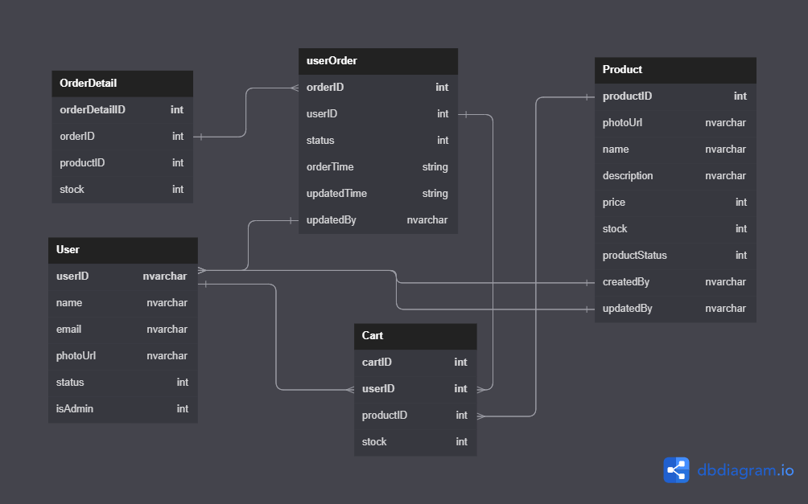

## Project setup

### How to run?

```
1. npm install
2. node server.js or npm run start
```

### How to connect to Azure database?

```
1. Make sure there is a credential file in "/app/ssl/key/DigiCertGlobalRootCA.crt.pem"
2. Make sure the config is right.

If you still can not connect to Azure database, please connect to me. I'll do my best to help you out or you just change database config to localhost.
```

### Database Schema

## 

### Status correspondence table

### User Status

| Value | Status | isAdmin |
| ----- | :----: | ------: |
| True  |   1    |       1 |
| False |   0    |       0 |

### Product Status

| Value  | productStatus |
| ------ | :-----------: |
| opened |       1       |
| closed |       0       |

### Order Status

| Value      | Status |
| ---------- | :----: |
| In Process |   0    |
| In Transit |   1    |
| Completed  |   2    |
| Canceled   |   3    |

---
